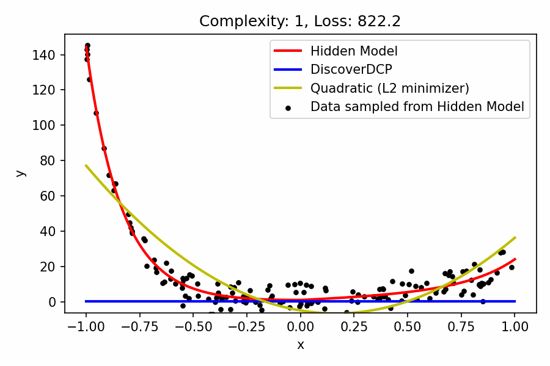

  

  

    <em>DiscoverDCP</em> is proposed as a data-driven framework that integrates symbolic regression with the rule sets of Disciplined Convex Programming (DCP) to perform system identification under the non-trivial but not uncommon assumption that the underlying system is convex. By enforcing that all discovered candidate model expressions adhere to DCP rules, it is ensured that the output expressions are guaranteed to be convex, circumventing the process of convexity verification. The advantage of this approach is that the discovered model expressions are permitted to exhibit more relaxed functional forms than typically used fixed parameter convex expressions (e.g., quadratic function with non-negative Hessian). The proposed method is intended to produce interpretable, verifiable, and flexible convex surrogates suitable for various scientific domains.
  

